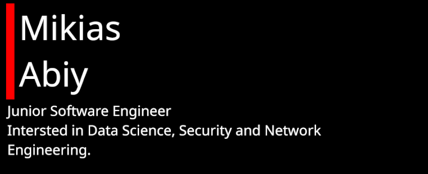

# Hi I am Mikias Abiy

I am a passionate highly motivated junior software engineer from Ethiopia. I am passionate about security and network engineering. Currently following a full stack developer learning path on [freeCodeCamp](https://www.freecodecamp.org/).

### Find me on the web
[linkedin](https://www.linkedin/in/mikias-abiy) 

 
 

 
 

 

### Projects
Here are some mile stone projects i have done.
* [**Monty**](https://github.clm/mikias-abiy/monty#readme): A simple interpreted stack oriented scripting language built with C.
* [**Responsive Web Designs**](https://github.com/mikias-abiy/responsive_web_designs#readme): Collection of responsive web design milestone projects from my freeCodeCamp Responsive Web Design curriculum.
* [**Simple Shell**](https://github.com/mikias-abiy/simple_shell#readme): This is a simple UNIX shell built with C that performs some tasks that a standard UNIX shell can perform.
